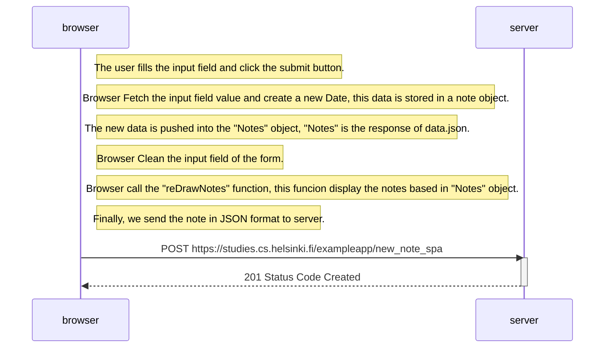

```mermaid
sequenceDiagram
    participant browser
    participant server

    Note right of browser: The user fills the input field and click the submit button.
    
    Note right of browser: Browser Fetch the input field value and create a new Date, this data is stored in a note object.

    Note right of browser: The new data is pushed into the "Notes" object, "Notes" is the response of data.json.

    Note right of browser: Browser Clean the input field of the form.

    Note right of browser: Browser call the "reDrawNotes" function, this funcion display the notes based in "Notes" object.

    Note right of browser: Finally, we send the note in JSON format to server.

    browser->>server: POST https://studies.cs.helsinki.fi/exampleapp/new_note_spa
    activate server
    server-->>browser: 201 Status Code Created
    deactivate server

```